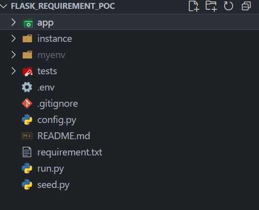

# 🧪 POC: Gestión y Validación de Requisitos Técnicos

Este proyecto es un Proof of Concept para automatizar la captura de requisitos funcionales y validar su cumplimiento técnico desde el backend.

## 🎯 Objetivo

- Capturar requisitos de forma estructurada
- Asociarlos a funcionalidades y pruebas
- Validar automáticamente si el software cumple lo definido

## 🧰 Tecnologías

- **Flask** – Framework web ligero
- **SQLAlchemy** – ORM para modelado relacional
- **SQLite** – Base de datos local y portable
- **Jinja2** – Templates para frontend
- **Python-dotenv** – Configuración vía `.env`
- **HTML/CSS** – Interfaz básica
- **Seed.py** – Script para poblar datos iniciales

## 🗂️ Estructura del Proyecto

La siguiente imagen muestra la estructura del proyecto `FLASK_REQUIREMENT_POC`, incluyendo carpetas clave como `app`, `instance`, `tests`, y archivos como `run.py`, `seed.py`, y `.env`.




## 🛠️ Uso

```bash
pip install -r requirements.txt
python run.py

